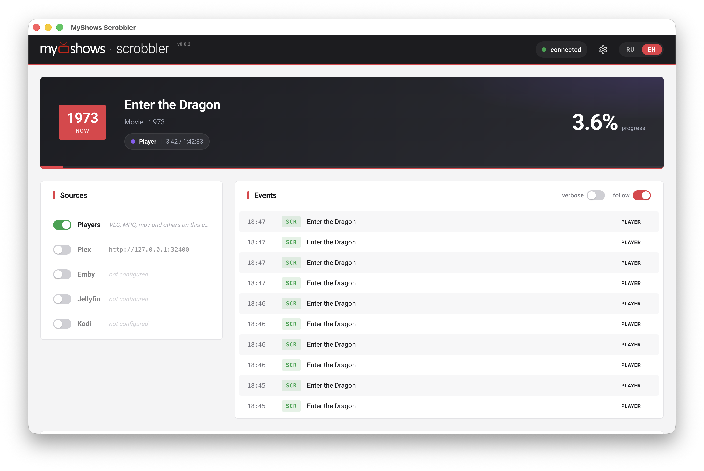

<div align="center">


# MyShows Scrobbler

**Universal scrobbler for [MyShows.me](https://myshows.me) — Plex, Jellyfin, Emby, Kodi and desktop players.**

[Русская версия](README.md)

[](https://github.com/myshowsme/myshows-scrobbler/releases)
[](https://github.com/myshowsme/myshows-scrobbler/releases/latest)
[](LICENSE)

[Installation](#installation) · [Quick start](#quick-start) · [Sources](#sources) · [Lampa](#lampa) · [Without the app](#without-the-desktop-app) · [Development](#development)

</div>

---

Watch the way you always do, in Plex, Jellyfin, Emby, Kodi or a plain desktop player. Don't worry about check-ins: your watch progress and date go to your [MyShows.me](https://myshows.me) profile automatically.

The scrobbler runs locally: it tracks playback, and once you pass the watch threshold (80% by default) it checks the episode in on MyShows. Abandoned episodes don't count. No telemetry — data only goes to MyShows and your own media servers.

## Screenshots

<div align="center">



</div>

## Installation

Grab a build from the [Releases](https://github.com/myshowsme/myshows-scrobbler/releases/latest) page:

| Platform              | File                                    |
| --------------------- | --------------------------------------- |
| Windows               | `MyShows Scrobbler Setup <version>.exe` |
| macOS (Apple Silicon) | `*-arm64.dmg`                           |
| Linux                 | `*.AppImage` (portable, experimental)   |

Nothing else to install — the builds are self-contained: ffprobe and the native modules are bundled in.

> - **macOS** — the build is signed with an Apple Developer ID certificate and notarized: it installs and launches with no warnings.
> - **Windows** — the build is unsigned; SmartScreen will warn: **More info → Run anyway**.
> - **Linux** — the AppImage is not signed; make it executable if needed (`chmod +x`).

The app lives in the tray and keeps scrobbling with the window closed. Updates come from GitHub Releases; the app asks before installing one.

## Quick start

1. **MyShows token.** Get the token from your [profile](https://en.myshows.me/profile/watch-history/) and paste it into the field at the top; it is verified immediately.
2. **Enable a source.** If Plex or Kodi run on the same machine, the token and URL are filled in automatically. Jellyfin offers Quick Connect (a code on screen, confirmed on the server), Emby offers username/password sign-in. No media server? Enable "Local player".
3. **Play something.** A "Now playing" card shows up in the app, which means your watch progress is being sent to MyShows.

## Sources

| Source                        | Setup                                                                                                                                                                                                                                        |
| ----------------------------- | -------------------------------------------------------------------------------------------------------------------------------------------------------------------------------------------------------------------------------------------- |
| **Plex**                      | Token is discovered automatically from a local Plex Media Server. For a remote server, paste the `X-Plex-Token` manually                                                                                                                     |
| **Jellyfin**                  | Quick Connect or an API key                                                                                                                                                                                                                  |
| **Emby**                      | Username/password sign-in or an API key                                                                                                                                                                                                      |
| **Kodi**                      | Web interface username, password and port are discovered automatically, or set by hand                                                                                                                                                       |
| **VLC, mpv, MPC-HC/BE, IINA** | One click in the Setup panel: the app can edit the player config itself (HTTP interface for VLC and MPC, IPC for mpv and IINA) and starts reading exact position and state                                                                   |
| **Stremio**                   | Cloud source: paste your Stremio account authKey (from the web.stremio.com console: `JSON.parse(localStorage.profile).auth.key`). Reads the `api.strem.io` library and catches playback from every Stremio client — web, desktop, mobile, TV |
| **Local player**              | Zero config: process scanning plus system media APIs (SMTC on Windows, AppleScript on macOS). Also catches players that have no dedicated adapter                                                                                            |

### Features

- Tracks your watch progress and saves it for you automatically.
- Shows and movies are recognized and matched automatically on the MyShows side.
- Rewatches are recorded too.
- Older Plex libraries built on legacy agents (`com.plexapp.agents.*`), including the HAMA anime scanner, are supported too.

### Local player limitations

- The scrobbler must run on the same machine as the player. Host processes are not visible from Docker.
- Players wired through the Setup panel report an exact position via their API. For everything else, progress is estimated from process uptime, so pauses and seeking are invisible in that mode.
- Title, season and episode are extracted from the file name automatically: [guessit-js](https://github.com/wuestholz/guessit-js).

## Lampa

Watching in [Lampa](https://lampa.mx)? It has a plugin of its own — [myshows-scrobbler-lampa](https://github.com/myshowsme/myshows-scrobbler-lampa). It scrobbles to MyShows straight from Lampa, so the desktop app from this repo isn't needed — including on TVs, where there is nothing to run it on (Tizen, webOS; the plugin is built for ES5).

Install it via **Settings → Extensions → Add plugin by URL**:

```
https://myshowsme.github.io/myshows-scrobbler-lampa/myshows.js
```

From there it's the same [MyShows token](https://en.myshows.me/profile/watch-history/) in the plugin settings (verified as soon as you paste it) and a configurable scrobble threshold (50–95%). The token is stored per Lampa profile.

## Without the desktop app

The scrobbler doesn't have to live on your computer. If you have a NAS or a home server, put it there — scrobbles keep reaching MyShows even while your computer is off. That's what you want if you watch from a TV or a phone.

One limitation: from inside a container the apps running on your computer aren't visible, so "Local player", VLC and mpv won't work this way. Plex, Jellyfin, Emby and Kodi will — the scrobbler reaches those over the network.

### Docker

Nothing to compile, a prebuilt image is already published. It runs on ordinary Intel/AMD processors as well as on ARM ones — which is what most NAS boxes and the Raspberry Pi use.

**1. Create a folder for the settings.** This is where the scrobbler keeps its config, so updating the image doesn't wipe it:

```bash
mkdir -p /volume1/docker/myshows-scrobbler/data
sudo chown -R 1001:1001 /volume1/docker/myshows-scrobbler/data
```

Substitute your own path — on a NAS the shares usually sit under `/volume1`, `/Volume1` or `/share`; `ls /` will show you.

The second command hands the folder to the user the container runs as. Without it the scrobbler can't save its settings and forgets your token on every restart. On Windows and macOS you can skip this step.

**2. Start the container:**

```bash
docker run -d \
  --name myshows-scrobbler \
  --restart unless-stopped \
  -p 3000:3000 \
  -v /volume1/docker/myshows-scrobbler/data:/data \
  ghcr.io/myshowsme/myshows-scrobbler:latest
```

`--restart unless-stopped` means the scrobbler comes back up on its own after the NAS reboots.

**3. Open the web UI** at your server's address on port 3000 — `http://192.168.1.50:3000`, for instance. From there it's the same as the desktop app: paste your [MyShows token](https://en.myshows.me/profile/watch-history/) and enable a source.

One subtlety when connecting a media server running on that same machine: give its network address (`http://192.168.1.50:8096`), not `localhost`. To the container, `localhost` means itself — not your Jellyfin.

To check that it came up, run `docker logs myshows-scrobbler` and look for a `Server listening` line.

#### Using docker compose

The repo ships a ready [docker-compose.yml](docker-compose.yml):

```bash
docker compose up -d
```

The `data` folder needs the same ownership as above.

#### Building the image yourself

Only needed if you're working on the code: uncomment `build: .` in [docker-compose.yml](docker-compose.yml) and `docker compose up -d` will build from your local sources.

### Node.js

Requires Node.js 24+ and [pnpm](https://pnpm.io/) 11+ (`corepack enable`).

```bash
pnpm install
pnpm build:all
pnpm start:ui        # server + web UI on :5172
```

Or in one go: [start.sh](start.sh) (Linux/macOS) and [start.bat](start.bat) (Windows) check Node, install dependencies and start the server.

The `--ui` flag serves the web UI. The `CONFIG_PATH` env var sets the config location (default `./data/config.json`, `/data/config.json` in Docker).

## Configuration

Everything is configurable from the UI, or by hand in `data/config.json`:

```json
{
  "myshows_token": "your_bearer_token_from_myshows.me",
  "scrobble_percent": 80,
  "log_level": "info",
  "sources": [
    {
      "type": "plex",
      "enabled": true,
      "url": "http://localhost:32400",
      "token": "plex_x_token",
      "poll_interval": 5000
    }
  ]
}
```

- `scrobble_percent`: the "watched" threshold, in percent.
- `poll_interval`: source polling period, ms.

### Filtering users

On a shared Plex, Emby or Jellyfin server, sessions from every user get scrobbled. To count only your own playback, add a `user_filter` to the source — a list of usernames or user IDs. There is no UI field for it; set it by hand in `data/config.json`:

```json
{
  "type": "plex",
  "url": "http://localhost:32400",
  "token": "plex_x_token",
  "user_filter": ["username"]
}
```

The same for Emby or Jellyfin:

```json
{
  "type": "emby",
  "url": "http://localhost:8096",
  "token": "emby_api_key",
  "user_filter": ["username"]
}
```

Only sessions whose username or ID matches an entry are counted — `User.title` and `User.id` on Plex, `UserName` and `UserId` on Emby and Jellyfin. Case and surrounding whitespace don't matter.
Without a `user_filter`, every viewer counts.
Sessions the filter turns away are named in the `debug` log.

## Scrobble API

The scrobbler talks to MyShows over a simple HTTP API (`POST /start`, `/pause`, `/stop`, `GET /check`) with `Authorization: Bearer <token>` auth. The payload format is a superset of the Trakt and Simkl scrobble APIs. The full DTO lives in [src/scrobblers/scrobble-dto.ts](src/scrobblers/scrobble-dto.ts).

## Development

The toolchain is [Vite+](https://viteplus.dev/): build, lint, formatting and tests under one command.

```bash
pnpm dev             # headless server with auto-reload
pnpm dev:all         # server + Vue UI dev server (:5173)
pnpm check           # format + lint + typecheck
pnpm test            # unit tests
pnpm test:e2e        # playwright (builds the project first)
```

### Adding a source

1. Subclass [`BaseAdapter`](src/adapters/base.ts): `name`, `checkConnection`, `poll()`. The base class runs the polling timer; the adapter calls `emitScrobble(event)`.
2. Add the type to the `SourceType` union in [src/types.ts](src/types.ts). Sources without a URL/token belong in `LOCAL_SOURCE_TYPES`.
3. `registerAdapter(...)` in [src/server.ts](src/server.ts) and the type in `VALID_SOURCE_TYPES` in [src/routes/api.ts](src/routes/api.ts).
4. `pnpm generate:ui-types`.

Anti-spam, the threshold and retries live in the shared pipeline (`handleScrobble`); adapters don't deal with them.

See [CONTRIBUTING.md](CONTRIBUTING.md) for how to send PRs and report bugs.

## License

MIT
