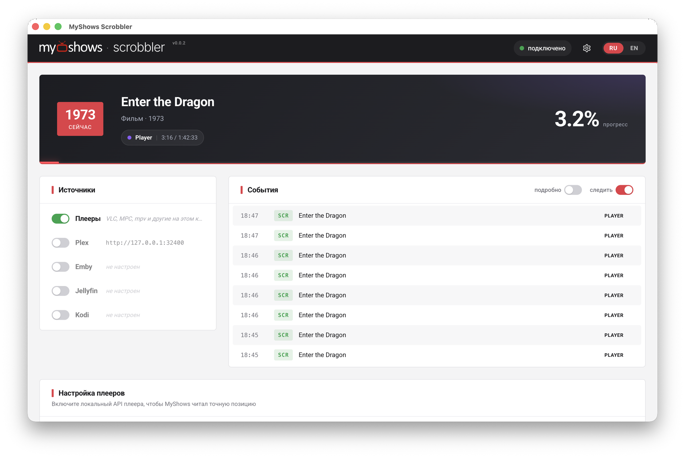

<div align="center">


# MyShows Scrobbler

**Универсальный скробблер для [MyShows.me](https://myshows.me) — Plex, Jellyfin, Emby, Kodi и десктопные плееры.**

[English](README.en.md)

[](https://github.com/myshowsme/myshows-scrobbler/releases)
[](https://github.com/myshowsme/myshows-scrobbler/releases/latest)
[](LICENSE)

[Установка](#установка) · [Быстрый старт](#быстрый-старт) · [Источники](#источники) · [Lampa](#lampa) · [Без приложения](#без-десктоп-приложения) · [Разработка](#разработка)

</div>

---

Смотрите привычным вам способом — в Plex, Jellyfin, Emby, Kodi или просто в десктопном плеере. Не переживайте об отметке: прогресс просмотра и дата отправляются в ваш профиль [MyShows.me](https://myshows.me).

Скробблер работает локально: следит за воспроизведением, и когда вы досмотрели серию до порога (по умолчанию 80%), отправляет отметку в MyShows. Недосмотренное не засчитывается. Никакой телеметрии — данные уходят только в MyShows и на ваши медиасерверы.

## Скриншоты

<div align="center">



</div>

## Установка

Готовые сборки — на странице [Releases](https://github.com/myshowsme/myshows-scrobbler/releases/latest):

| Платформа             | Файл                                      |
| --------------------- | ----------------------------------------- |
| Windows               | `MyShows Scrobbler Setup <версия>.exe`    |
| macOS (Apple Silicon) | `*-arm64.dmg`                             |
| Linux                 | `*.AppImage` (portable, экспериментально) |

Ставить что-либо дополнительно не нужно — сборки самодостаточны: ffprobe и нативные модули уже внутри.

> - **macOS** — сборка подписана сертификатом Apple Developer ID и нотаризована: ставится и запускается без предупреждений.
> - **Windows** — сборка не подписана, SmartScreen покажет предупреждение: **Подробнее → Выполнить в любом случае**.
> - **Linux** — AppImage не подписывается; при необходимости сделайте файл исполняемым (`chmod +x`).

Приложение живёт в трее и продолжает скробблить с закрытым окном. Обновления подтягиваются с GitHub Releases — приложение спросит, прежде чем ставить.

## Быстрый старт

1. **Токен MyShows.** Возьмите токен в вашем [профиле](https://myshows.me/profile/watch-history/) и вставьте в поле наверху — приложение сразу проверит его.
2. **Включите источник.** Если Plex или Kodi установлены на этой же машине, токен и адрес подставятся автоматически. Для Jellyfin есть Quick Connect (код на экране — подтверждение на сервере), для Emby — вход по логину и паролю. Если смотрите без медиасервера, включите «Локальный плеер».
3. **Запустите что-нибудь.** Карточка «Сейчас смотрю» появится в приложении — это значит, что прогресс просмотра начал отправляться на MyShows.

## Источники

| Источник                      | Подключение                                                                                                                                                                                                                            |
| ----------------------------- | -------------------------------------------------------------------------------------------------------------------------------------------------------------------------------------------------------------------------------------- |
| **Plex**                      | Токен находится автоматически в локальном Plex Media Server. Для удалённого сервера — вручную (`X-Plex-Token`)                                                                                                                         |
| **Jellyfin**                  | Quick Connect или API-ключ                                                                                                                                                                                                             |
| **Emby**                      | Вход по логину и паролю или API-ключ                                                                                                                                                                                                   |
| **Kodi**                      | Логин, пароль и порт веб-интерфейса находятся автоматически или задаются вручную                                                                                                                                                       |
| **VLC, mpv, MPC-HC/BE, IINA** | Включаются одной кнопкой в панели Setup: приложение само может править конфиг плеера (HTTP-интерфейс у VLC и MPC, IPC у mpv и IINA) и начнёт получать точные позицию и состояние                                                       |
| **Stremio**                   | Облачный источник: вставьте authKey аккаунта Stremio (из консоли web.stremio.com: `JSON.parse(localStorage.profile).auth.key`). Читает библиотеку `api.strem.io` и ловит просмотры со всех клиентов Stremio — web, desktop, мобайл, TV |
| **Локальный плеер**           | Нулевая настройка: сканирование процессов + системные медиа-API (SMTC на Windows, AppleScript на macOS). Ловит и плееры, для которых нет отдельного адаптера                                                                           |

### Что умеет

- Отслеживаем прогресс просмотра и автоматически сохраняем его для вас.
- Сериалы и фильмы распознаются и сопоставляются автоматически на стороне MyShows.
- Повторные просмотры тоже фиксируются.

### Ограничения локального плеера

- Скробблер должен работать на той же машине, что и плеер. Из Docker процессы хоста не видны.
- Для плееров, подключённых через панель Setup, позиция точная — берётся из API плеера. Для остальных прогресс оценивается по времени жизни процесса: паузы и перемотки в этом режиме не видны.
- Название, сезон и серия автоматически извлекаются из имени файла — [guessit-js](https://github.com/wuestholz/guessit-js).

## Lampa

Смотрите в [Lampa](https://lampa.mx)? Для неё есть отдельный плагин — [myshows-scrobbler-lampa](https://github.com/myshowsme/myshows-scrobbler-lampa). Он отправляет отметки в MyShows сам, прямо из Lampa: десктопное приложение из этого репозитория ставить не нужно, и работает он в том числе на ТВ, где его негде запустить (Tizen, webOS — плагин собран под ES5).

Установка: **Настройки → Расширения → Добавить плагин по URL**

```
https://myshowsme.github.io/myshows-scrobbler-lampa/myshows.js
```

Дальше — тот же [токен MyShows](https://myshows.me/profile/watch-history/) в настройках плагина (проверяется сразу при вводе) и настраиваемый порог отметки (50–95%). Токен хранится отдельно для каждого профиля Lampa.

## Без десктоп-приложения

Тот же сервер можно запустить headless — на NAS, домашнем сервере или просто в терминале. Локальные плееры из Docker работать не будут, медиасерверы — без ограничений.

### Docker

```bash
docker compose up -d
```

Веб-интерфейс — на `http://localhost:3000`, конфиг — в томе `./data/config.json`. (Docker-образ задаёт порт `3000`; собственный дефолт приложения — `5172`.)

### Node.js

Нужны Node.js 24+ и [pnpm](https://pnpm.io/) 11+ (`corepack enable`).

```bash
pnpm install
pnpm build:all
pnpm start:ui        # сервер + веб-интерфейс на :5172
```

Или одной командой: [start.sh](start.sh) (Linux/macOS) и [start.bat](start.bat) (Windows) — проверят Node, поставят зависимости и запустят сервер.

Флаг `--ui` раздаёт веб-интерфейс. Переменная `CONFIG_PATH` задаёт путь к конфигу (по умолчанию `./data/config.json`, в Docker — `/data/config.json`).

## Конфигурация

Всё настраивается через интерфейс, но можно и руками — `data/config.json`:

```json
{
  "myshows_token": "ваш_bearer_token_с_myshows.me",
  "scrobble_percent": 80,
  "log_level": "info",
  "sources": [
    {
      "type": "plex",
      "enabled": true,
      "url": "http://localhost:32400",
      "token": "plex_x_token",
      "poll_interval": 5000
    }
  ]
}
```

- `scrobble_percent` — порог отметки «просмотрено», в процентах.
- `poll_interval` — период опроса источника, мс.

### Фильтр пользователей Plex

На общем Plex-сервере скробблятся сеансы всех пользователей. Чтобы засчитывать только свои просмотры, добавьте к источнику `plex` поле `user_filter` — список имён или ID пользователей Plex. В интерфейсе этого поля нет, оно задаётся только вручную в `data/config.json`:

```json
{
  "type": "plex",
  "url": "http://localhost:32400",
  "token": "plex_x_token",
  "user_filter": ["UserName"]
}
```

Засчитываются только сеансы, у которых имя (`User.title`) или ID (`User.id`) совпадает с записью из списка. Сравнение без учёта регистра и пробелов по краям. Пустой или отсутствующий `user_filter` — засчитываются все зрители.

## API скробблинга

Скробблер общается с MyShows по простому HTTP API (`POST /start`, `/pause`, `/stop`, `GET /check`) с авторизацией `Authorization: Bearer <токен>`. Формат payload — надмножество scrobble-API Trakt и Simkl. Полное описание DTO — в [src/scrobblers/scrobble-dto.ts](src/scrobblers/scrobble-dto.ts).

## Разработка

Тулчейн — [Vite+](https://viteplus.dev/): сборка, линт, форматирование и тесты одной командой.

```bash
pnpm dev             # headless-сервер с auto-reload
pnpm dev:all         # сервер + Vue UI dev-сервер (:5173)
pnpm check           # формат + линт + typecheck
pnpm test            # unit-тесты
pnpm test:e2e        # playwright (сам соберёт проект)
```

### Новый источник

1. Класс-наследник [`BaseAdapter`](src/adapters/base.ts): `name`, `checkConnection`, `poll()`. Таймер опроса поднимает базовый класс; адаптер зовёт `emitScrobble(event)`.
2. Тип в union `SourceType` в [src/types.ts](src/types.ts). Источникам без URL/токена место в `LOCAL_SOURCE_TYPES`.
3. `registerAdapter(...)` в [src/server.ts](src/server.ts) и тип в `VALID_SOURCE_TYPES` в [src/routes/api.ts](src/routes/api.ts).
4. `pnpm generate:ui-types`.

Анти-спам, порог и ретраи живут в общем pipeline (`handleScrobble`) — адаптеру о них думать не нужно.

Как присылать PR и сообщать о багах — в [CONTRIBUTING.md](CONTRIBUTING.md).

## Лицензия

MIT
